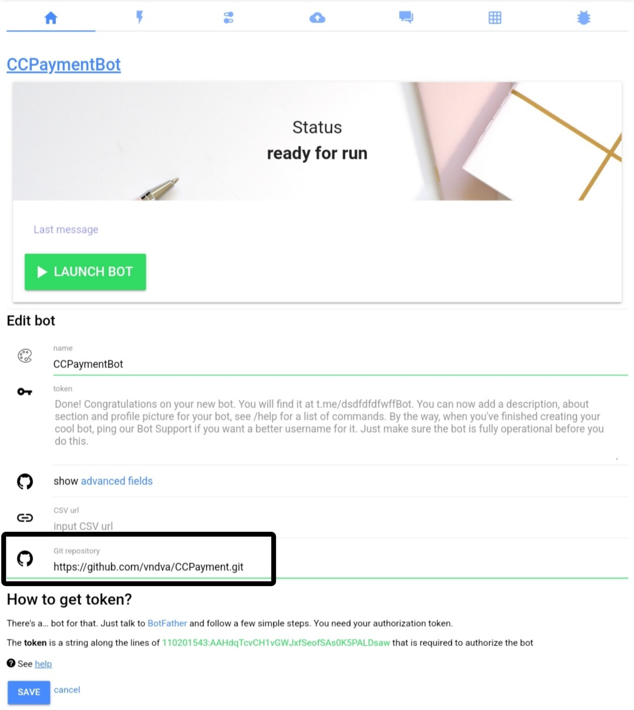
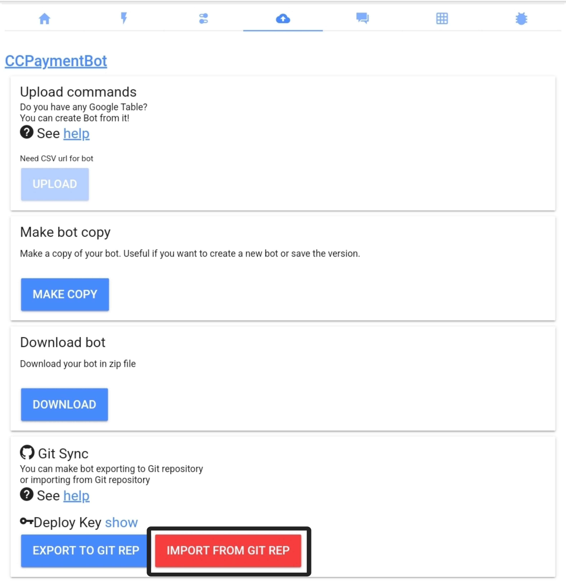

# CCPaymentLibs
A simple library for interacting with the CCPayment official API within Bots.Business client.

## What is CCPayment?
[CCPayment](https://ccpayment.com) is a payment gateway that facilitates the processing of Bitcoin, Ethereum, and other cryptocurrencies. It utilizes a unique unified payment API that can be easily integrated with any website or e-commerce platform; hence, businesses can accept 45+ cryptocurrencies via a single checkout page.

CCPayment allows you send and receive payments in crypto from your friends and family around the world. Whether your customers use CCPayment or not, we create a contactless, seamless and secure checkout experience. Make crypto payments to anyone and collect crypto payments with ease.

- Read more: [v1 API docs](https://ccpayment.com/payment-doc-v1/)
- Read more: [v2 API docs](https://ccpayment.com/api/doc?en#introduction)

## Feature
- [x] Supports both v1 and v2 API
- [x] Get supported token list
- [x] Get supported chain list
- [x] Get token price
- [x] Query merchant balance
- [x] Calculate token rate
- [x] Get network fee
- [x] Generate permanent deposit address
- [x] Create hosted checkout page
- [x] Create native checkout invoice
- [x] Create external withdrawal
- [x] Create internal transfer between CWallet user
- [x] Create swap order
- [x] Get swap quote
- [x] Get swap record

## Documentation & flow
- [Usage](#Usage)
- [v1 API class](#Version-1-API)
  - [Payment](#Payment-API)
    - [createHostedInvoice](#1-createHostedInvoice)
    - [createNativeInvoice](#2-createNativeInvoice)
    - [getInvoiceDetail](#3-getInvoiceDetail)
  - [Wallet](#Wallet-API)
    - [createPermanentAddress](#1-createPermanentAddress)
  - [Withdrawal](#Withdrawal-API)
    - [createWithdrawal](#1-createWithdrawal)
    - [getWithdrawalDetail](#2-getWithdrawalDetail)
  - [Resources](#Resources-API)
    - [getSupportedCoins](#1-getSupportedCoins)
    - [calculateTokenRate](#2-calculateTokenRate)
    - [getBalance](#3-getBalance)
    - [getNetworkFee](#4-getNetworkFee)
    - [getBlockHeight](#5-getBlockHeight)
    - [validateCWalletId](#6-validateCWalletId)
- [v2 API class](#Version-2-API)
  - [Common](#Common-API)
    - [getTokenList](#1-getTokenList)
    - [getTokenInformation](#2-getTokenInformation)
    - [getTokenPrice](#3-getTokenPrice)
    - [getCWalletUserInfo](#4-getCWalletUserInfo)
    - [getWithdrawFee](#5-getWithdrawFee)
    - [getFiatList](#6-getFiatList)
    - [getChainList](#7-getChainList)
  - [Merchant](#Merchant-API)
    - [getBalanceList](#1-getBalanceList)
    - [getCoinBalance](#2-getCoinBalance)
    - [createInvoice](#3-createInvoice)
    - [getInvoiceDetail](#4-getInvoiceDetail)
    - [createPermanentAddress](#5-createPermanentAddress)
    - [getDepositRecord](#6-getDepositRecord)
    - [getDepositRecordList](#7-getDepositRecordList)
    - [externalWithdraw](#8-externalWithdraw)
    - [internalWithdraw](#9-internalWithdraw)
    - [getWithdrawalRecord](#10-getWithdrawalRecord)
    - [getWithdrawalRecordList](#11-getWithdrawalRecordList)
    - [getSwapQuote](#12-getSwapQuote)
    - [createSwapOrder](#13-createSwapOrder)
    - [getSwapRecord](#14-getSwapRecord)
    - [getSwapRecordList](#15-getSwapRecordList)
  - [Wallet system](#Wallet-system-API)
    - [getUserBalanceList](#1-getUserBalanceList)
    - [getUserBalance](#2-getUserBalance)
    - [getUserDepositAddress](#3-getUserDepositAddress)
    - [getUserDepositRecord](#4-getUserDepositRecord)
    - [getUserDepositRecordList](#5-getUserDepositRecordList)
    - [externalUserWithdraw](#6-externalWithdraw)
    - [internalUserWithdraw](#7-internalWithdraw)
    - [getUserWithdrawalRecord](#8-getWithdrawalRecord)
    - [getUserWithdrawalRecordList](#9-getWithdrawalRecordList)
    - [internalUserTransfer](#10-internalTransfer)
    - [getUserTransferRecord](#11-getTransferRecord)
    - [getUserTransferRecordList](#12-getTransferRecordList)
    - [createUserSwapOrder](#13-createUserSwapOrder)
    - [getUserSwapRecord](#14-getUserSwapRecord)
    - [getUserSwapRecordList](#15-getUserSwapRecordList)
- [Contact](#Contact-me)

## Set this repo to your bot 

[Back](#documentation--flow)

## Import the lib into your bot

[Back](#documentation--flow)
 
## Usage

### Import class & function
```js
/**
 * CMDS: @
 */ 
const {
  setAppId,
  setAppSecret,
  v1, v2
} = Libs.CCPayment;

const { payment, wallet, withdrawal, resources } = v1;
const { common, merchant, walletSystem } = v2;

// or legacy
Libs.CCPayment.setAppId();
Libs.CCPayment.setAppSecret();
Libs.CCPayment.v1.classes.someMethod();
Libs.CCPayment.v2.classes.someMethod();
```
[Back](#documentation--flow)

### Setup
```js
/**
 * CMDS: /setup
 */
Libs.CCPayment.setAppId("yourAppIdAbc123");
Libs.CCPayment.setAppSecret("abcdef01234567901");

Bot.sendMessage("CCPayment: setup success.");
```
[Back](#documentation--flow)

## Version 1 API
Official documentation: https://ccpayment.com/payment-doc-v1/

### Payment API

#### 1. createHostedInvoice
```js
payment.createHostedInvoice({
    body: {
        product_name: "Some product name #123",
        product_price: "1",
        merchant_order_id: "order_id_123",
        // order_valid_period: 3600,
        // return_url: "https://example.com/",
        // notify_url: "https://notice.example.com",
        // custom_value: "some_custom_value"
    },
    onSuccess: "some_on_success_cmd"
});
```
[Back](#documentation--flow)

#### 2. createNativeInvoice
```js
payment.createNativeInvoice({
    body: {
      token_id: "0912e09a-d8e2-41d7-a0bc-a25530892988",
      product_price: "1",
      merchant_order_id: "order_id_123",
      denominated_currency: "USD",
      // remark: "some_remark",
      // order_valid_period: 3600
      // notify_url: "https://notice.example.com",
      // custom_value: "some_custom_value"
    },
    onSuccess: "some_on_success_cmd"
});
```
[Back](#documentation--flow)

#### 3. getInvoiceDetail
```js
payment.getInvoiceDetail({
    body: {
      merchant_order_ids: ["order_id_123", "order_id_456"]
    },
    onSuccess: "some_on_success_cmd"
});
```
[Back](#documentation--flow)

### Wallet API

#### 1. createPermanentAddress
```js
wallet.createPermanentAddress({
    body: {
      user_id: "some_unique_user_id_123",
      chain: "some_chain_name",
      // notify_url: "https://notice.example.com"
    },
    onSuccess: "some_on_success_cmd"
});
```
[Back](#documentation--flow)

### Withdrawal API

#### 1. createWithdrawal
```js
withdrawal.createWithdrawal ({
    body: {
      merchant_order_id: "some_order_id_123",
      address: "0xSomeWalletAddress",
      token_id: "0912e09a-d8e2-41d7-a0bc-a2553089298",
      value: "1",
      // memo: "some_address_memo",
      // merchant_pays_fee: false
    },
    onSuccess: "some_on_success_cmd"
});
```
[Back](#documentation--flow)

#### 2. getWithdrawalDetail
```js
withdrawal.getWithdrawalDetail({
    body: {
      merchant_order_ids: ["order_id_123", "order_id_456"]
    },
    onSuccess: "some_on_success_cmd"
});
```
[Back](#documentation--flow)

### Resources API

#### 1. getSupportedCoins
```js
resources.getSupportedCoins({
    // no parameter required
    onSuccess: "some_on_success_cmd"
});
```
[Back](#documentation--flow)

#### 2. calculateTokenRate
```js
resources.calculateTokenRate({
    body: {
      amount: "1",
      token_id: "0912e09a-d8e2-41d7-a0bc-a2553089298"
    },
    onSuccess: "some_on_success_cmd"
});
```
[Back](#documentation--flow)

#### 3. getBalance
```js
resources.getBalance({
    body: {
      // coin_id: "8e5741cf-6e51-4892-9d04-3d40e1dd0128"
    },
    onSuccess: "some_on_success_cmd"
});
```
[Back](#documentation--flow)

#### 4. getNetworkFee
```js
resources.getNetworkFee({
    body: {
      token_id: "0912e09a-d8e2-41d7-a0bc-a2553089298",
      // address: "0xSomeWalletAddress"
    },
    onSuccess: "some_on_success_cmd"
});
```
[Back](#documentation--flow)

#### 5. getBlockHeight
```js
resources.getBlockHeight({
    // no parameter required
    onSuccess: "some_on_success_cmd"
});
```
[Back](#documentation--flow)

#### 6. validateCWalletId
```js
resources.validateCWalletId({
    body: {
      c_id: "9454818"
    },
    onSuccess: "some_on_success_cmd"
});
```
[Back](#documentation--flow)

## Version 2 API
Official documentation: https://ccpayment.com/api/doc?en#introduction

### Common API

#### 1. getTokenList
```js
common.getTokenList({
    // no parameter required
    onSuccess: "some_on_success_cmd"
});
```
[Back](#documentation--flow)

#### 2. getTokenInformation
```js
common.getTokenInformation({
    body: {
      coinId: 1280
    },
    onSuccess: "some_on_success_cmd"
});
```
[Back](#documentation--flow)

#### 3. getTokenPrice
```js
common.getTokenPrice({
    body: {
      coinIds: [1280, 1234]
    },
    onSuccess: "some_on_success_cmd"
});
```
[Back](#documentation--flow)

#### 4. getCWalletUserInfo
```js
common.getCWalletUserInfo({
    body: {
      cwalletUserId: "9558861"
    },
    onSuccess: "some_on_success_cmd"
});
```
[Back](#documentation--flow)

#### 5. getWithdrawFee
```js
common.getWithdrawFee({
    body: {
      coinId: 1280,
      chain: "POLYGON"
    },
    onSuccess: "some_on_success_cmd"
});
```
[Back](#documentation--flow)

#### 6. getFiatList
```js
common.getFiatList({
    // no parameter required
    onSuccess: "some_on_success_cmd"
});
```
[Back](#documentation--flow)

#### 7. getChainList
```js
common.getChainList({
    body: {
      chains: ["ETH", "POLYGON", "BSC"]
    },
    onSuccess: "some_on_success_cmd"
});
```
[Back](#documentation--flow)

### Merchant API

#### 1. getBalanceList
```js
merchant.getBalanceList({
    // no parameter required
    onSuccess: "some_on_success_cmd"
});
```
[Back](#documentation--flow)

#### 2. getCoinBalance
```js
merchant.getCoinBalance({
    body: {
      coinId: 1280
    },
    onSuccess: "some_on_success_cmd"
});
```
[Back](#documentation--flow)

#### 3. createInvoice
```js
merchant.createInvoice({
    body: {
      coinId: 1280,
      price: "1",
      chain: "POLYGON",
      orderId: "some_order_id_123",
      // fiatId: 123,
      // expiredAt: Math.floor(Date.now() / 1000) + 3600,
      // buyerEmail: "someone@gmail.com",
      // generateCheckoutURL: false,
      // product: "some_product_name",
      // returnUrl: "https://example.com"
    },
    onSuccess: "some_on_success_cmd"
});
```
[Back](#documentation--flow)

#### 4. getInvoiceDetail
```js
merchant.getInvoiceDetail({
    body: {
      orderId: "some_order_id_123"
    },
    onSuccess: "some_on_success_cmd"
});
```
[Back](#documentation--flow)

#### 5. createPermanentAddress
```js
merchant.createPermanentAddress({
    body: {
      referenceId: "some_reference_id",
      chain: "POLYGON"
    },
    onSuccess: "some_on_success_cmd"
});
```
[Back](#documentation--flow)

#### 6. getDepositRecord
```js
merchant.getDepositRecord({
    body: {
      recordId: "some_record_id_123"
    },
    onSuccess: "some_on_success_cmd"
});
```
[Back](#documentation--flow)

#### 7. getDepositRecordList
```js
merchant.getDepositRecordList({
    body: {
      // coinId: 1280,
      // referenceId: "some_reference_id",
      // orderId: "some_order_id_123",
      // chain: "POLYGON",
      // startAt: 1721297348,
      // endAt: 1721300968,
      // nextId: "some_next_id"
    },
    onSuccess: "some_on_success_cmd"
});
```
[Back](#documentation--flow)

#### 8. externalWithdraw
```js
merchant.externalWithdraw({
    body: {
      coinId: 1280,
      chain: "POLYGON",
      address: "0xSomeWalletAddress",
      orderId: "some_order_id_123",
      amount: "1",
      // memo: "some_address_memo",
      // merchantPayNetworkFee: false
    },
    onSuccess: "some_on_success_cmd"
});
```
[Back](#documentation--flow)

#### 9. internalWithdraw
```js
merchant.internalWithdraw({
    body: {
      coinId: 1280,
      cwalletUser: "9558861",
      amount: "1",
      orderId: "some_order_id_123"
    },
    onSuccess: "some_on_success_cmd"
});
```
[Back](#documentation--flow)

#### 10. getWithdrawalRecord
```js
merchant.getWithdrawalRecord({
    body: {
      // recordId: "some_record_id_123",
      // orderId: "some_order_id_123"
    },
    onSuccess: "some_on_success_cmd"
});
```
[Back](#documentation--flow)

#### 11. getWithdrawalRecordList
```js
merchant.getWithdrawalRecordList({
    body: {
      // coinId: 1280,
      // orderIds: ["some_order_id_123", "some_order_id_456"],
      // chain: "POLYGON",
      // startAt: 1721297348,
      // endAt: 1721300968,
      // nextId: "some_next_id"
    },
    onSuccess: "some_on_success_cmd"
});
```
[Back](#documentation--flow)

#### 12. getSwapQuote
```js
merchant.getSwapQuote({
    body: {
      coinIdIn: 1280,
      amountIn: "100",
      coinIdOut: 1329
    },
    onSuccess: "some_on_success_cmd"
});
```
[Back](#documentation--flow)

#### 13. createSwapOrder
```js
merchant.createSwapOrder({
    body: {
      orderId: "some_order_id_123",
      coinIdIn: 1280,
      amountIn: "100",
      coinIdOut: 1329,
      // amountOutMinimum: ""
    },
    onSuccess: "some_on_success_cmd"
});
```
[Back](#documentation--flow)

#### 14. getSwapRecord
```js
merchant.getSwapRecord({
    body: {
      // recordId: "some_record_id_123",
      // orderId: "some_order_id_123"
    },
    onSuccess: "some_on_success_cmd"
});
```
[Back](#documentation--flow)

#### 15. getSwapRecordList
```js
merchant.getSwapRecordList({
    body: {
      // recordIds: ["some_record_id_123", ["some_record_id_456"],
      // orderIds: ["some_order_id_123", "some_order_id_456"],
      // coinIdIn: 1280,
      // coinIdOut: 1329,
      // startAt: 1721297348,
      // endAt: 1721300968,
      // nextId: "some_next_id"
    },
    onSuccess: "some_on_success_cmd"
});
```
[Back](#documentation--flow)

### Wallet system API

#### 1. getUserBalanceList
```js
walletSystem.getUserBalanceList({
    body: {
      userId: "user_id_123"
    },
    onSuccess: "some_on_success_cmd"
});
```
[Back](#documentation--flow)

#### 2. getUserBalance
```js
walletSystem.getUserBalance({
    body: {
      userId: "user_id_123",
      coinId: 1280
    },
    onSuccess: "some_on_success_cmd"
});
```
[Back](#documentation--flow)

#### 3. getUserDepositAddress
```js
walletSystem.getUserDepositAddress({
    body: {
      userId: "user_id_123",
      chain: "POLYGON"
    },
    onSuccess: "some_on_success_cmd"
});
```
[Back](#documentation--flow)

#### 4. getUserDepositRecord
```js
walletSystem.getUserDepositRecord({
    body: {
      recordId: "some_record_id_123"
    },
    onSuccess: "some_on_success_cmd"
});
```
[Back](#documentation--flow)

#### 5. getUserDepositRecordList
```js
walletSystem.getUserDepositRecordList({
    body: {
      // coinId: 1280,
      // userId: "user_id_123",
      // chain: "POLYGON",
      // startAt: 1721297348,
      // endAt: 1721300968,
      // nextId: "some_next_id"
    },,
    onSuccess: "some_on_success_cmd"
});
```
[Back](#documentation--flow)

#### 6. externalUserWithdraw
```js
walletSystem.externalUserWithdraw({
    body: {
      coinId: 1280,
      userId: "user_id_123",
      chain: "POLYGON",
      address: "0xSomeWalletAddress",
      orderId: "some_order_id_123",
      amount: "1",
      // memo: "some_address_memo"
    },
    onSuccess: "some_on_success_cmd"
});
```
[Back](#documentation--flow)

#### 7. internalUserWithdraw
```js
walletSystem.internalUserWithdraw({
    body: {
      coinId: 1280,
      userId: "user_id_123",
      cwalletUser: "9558861",
      amount: "1",
      orderId: "some_order_id_123"
    },
    onSuccess: "some_on_success_cmd"
});
```
[Back](#documentation--flow)

#### 8. getUserWithdrawalRecord
```js
walletSystem.getUserWithdrawalRecord({
    body: {
      // recordId: "some_record_id_123",
      // orderId: "some_order_id_123"
    },
    onSuccess: "some_on_success_cmd"
});
```
[Back](#documentation--flow)

#### 9. getUserWithdrawalRecordList
```js
walletSystem.getUserWithdrawalRecordList({
    body: {
      userId: "user_id_123",
      // coinId: 1280,
      // toAddress: "0xSomeWalletAddress",
      // chain: "POLYGON",
      // startAt: 1721297348,
      // endAt: 1721300968,
      // nextId: "some_next_id"
    },
    onSuccess: "some_on_success_cmd"
});
```
[Back](#documentation--flow)

#### 10. internalUserTransfer
```js
walletSystem.internalUserTransfer({
    body: {
      fromUserId: "user_id_123",
      toUserId: "user_id_456",
      coinId: 1280,
      amount: "1",
      orderId: "some_order_id_123",
      // remark: "some_remark"
    },
    onSuccess: "some_on_success_cmd"
});
```
[Back](#documentation--flow)

#### 11. getUserTransferRecord
```js
walletSystem.getUserTransferRecord({
    body: {
      // recordId: "record_id_123",
      // orderId: "order_id_123"
    },
    onSuccess: "some_on_success_cmd"
});
```
[Back](#documentation--flow)

#### 12. getUserTransferRecordList
```js
walletSystem.getUserTransferRecordList({
    body: {
      fromUserId: "user_id_123",
      toUserId: "user_id_456",
      // coinId: 1280,
      // startAt: 1721297348,
      // endAt: 1721300968,
      // nextId: "some_next_id"
    },
    onSuccess: "some_on_success_cmd"
});
```
[Back](#documentation--flow)

#### 13. createUserSwapOrder
```js
walletSystem.createUserSwapOrder({
    body: {
      orderId: "some_order_id_123",
      userId: "user_id_123",
      coinIdIn: 1280,
      amountIn: "100",
      coinIdOut: 1329,
      // extraFeeRate: "",
      // amountOutMinimum: ""
    },
    onSuccess: "some_on_success_cmd"
});
```
[Back](#documentation--flow)

#### 14. getUserSwapRecord
```js
walletSystem.getUserSwapRecord({
    body: {
      // recordId: "some_record_id_123",
      // orderId: "some_order_id_123"
    },
    onSuccess: "some_on_success_cmd"
});
```
[Back](#documentation--flow)

#### 15. getUserSwapRecordList
```js
walletSystem.getUserSwapRecordList({
    body: {
      // recordIds: ["some_record_id_123", ["some_record_id_456"],
      // orderIds: ["some_order_id_123", "some_order_id_456"],
      // userId: "some_user_id_123",
      // coinIdIn: 1280,
      // coinIdOut: 1329,
      // startAt: 1721297348,
      // endAt: 1721300968,
      // nextId: "some_next_id"
    },
    onSuccess: "some_on_success_cmd"
});
```
[Back](#documentation--flow)

## Contact me
You can contact me at [@mslylia](https://t.me/mslylia) on Telegram for any related questions.
